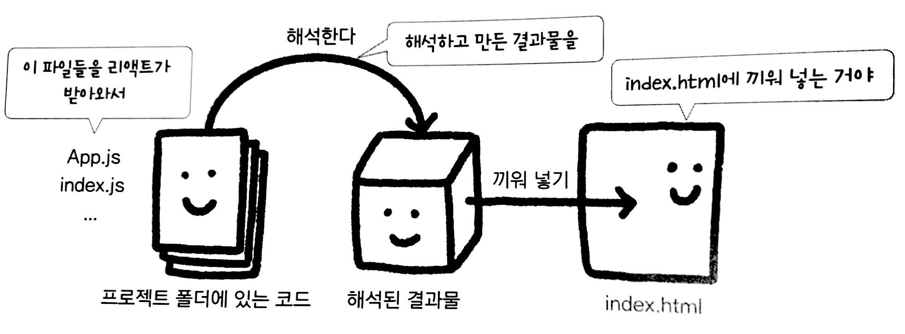

# Do it! Clone coding movie

# 💌 소개

`Do it! 클론 코딩 영화 평점 웹 서비스`를 따라 완성한 웹 사이트 예제입니다.

# 🛠 기술 스택

✔React를 이용하여 전체 컴포넌트/라우터/내비게이션/리다이렉트 기능 제작  
✔JSON 데이터를 활용하여 구성

# 💾 챕터별 정리

# 2chap - ES6 문법과 리액트 작동 원리

**🔸1. 3항 조건 연산자**  
MDN 공식 문서 https://developer.mozilla.org/ko/docs/Web/JavaScript/Reference/Operators/Conditional_Operator  
정리가 잘 되어 있는 벨로그 https://velog.io/@daybreak/Javascript-%EC%82%BC%ED%95%AD%EC%97%B0%EC%82%B0%EC%9E%90

**🔸2. async, await**  
예시와 함께 설명되어 있는 블로그 https://joshua1988.github.io/web-development/javascript/js-async-await/

**🔸3. Promise**  
예시와 함께 설명되어 있는 블로그 https://joshua1988.github.io/web-development/javascript/promise-for-beginners/

**🔸4. 구조 분해 할당**  
MDN 공식 문서 https://developer.mozilla.org/ko/docs/Web/JavaScript/Reference/Operators/Destructuring_assignment

**🔸5. 전개 (spread) 연산자**
MDN 공식 문서 https://developer.mozilla.org/ko/docs/Web/JavaScript/Reference/Operators/Spread_syntax

**🔸6. 보일러 플레이트(boiler plate)**  
보일러 플레이트란 개발을 바로 시작할 수 있도록 만든 기초 환경을 말한다.  
예시로 `create-react-app`이 있다.  
책에서는 npx를 이용했으나 나는 yarn을 이용해서 실습했다.

**🔸7. 리액트 동작 원리**  

# 3chap - 리액트 기초 개념

**🔸1. 컴포넌트**  
컴포넌트는 JSX 문법을 사용해서 작성한다. HTML과 JS를 결합한 형태이다.  
컴포넌트 이름을 작성할 때 중요한 규칙은 **대문자로 시작해야**한다는 점이다.

**🔸2. props**  
props에는 number, boolean, array 등 다양한 형태의 데이터를 담을 수 있다.  
props에 있는 데이터는 문자열인 경우를 제외하면 **모두 중괄호로 값을 감싸야** 한다.

# 5chap - state와 클래스형 컴포넌트

**🔸1. 클래스형 컴포넌트가 되려면?**  
리액트가 제공하는 Component 클래스를 반드시 상속받아야 한다.

**🔸2. 생명주기 함수**  
생명주기 함수는 `마운트(Mount) ➡ 업데이트(Update) ➡ 언마운트(Unmount)`단계로 분류되어 있다.  
여기서 마운트는 `constructor() ➡ render() ➡ componentDidMount()`로 구성되어 있다.  
책 속에서 업데이트는 `componentDidUpdate()`함수만 사용했다.  
언마운트도 `componenetWillUnmount()`함수만 사용했다.

**🔸3. fetch() 함수**  
잘 정리된 블로그 글 https://www.daleseo.com/js-window-fetch/  
MDN 공식 문서 https://developer.mozilla.org/ko/docs/Web/API/Fetch_API/Using_Fetch  
책에서는 fetch() 함수 대신 Axios를 사용했다.

**🔸4. Axios**  
Axious 가이드북 사이트 https://xn--xy1bk56a.run/axios/guide/#axios%EB%9E%80
